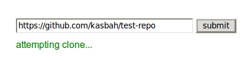
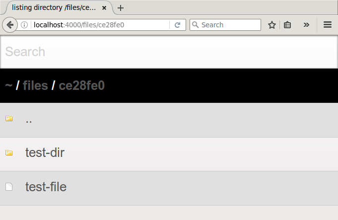

# git-clone-server

A microservice to clone Git repositories and serve the files for download.
This project uses node.js and Express.

| [**demo**](https://git-clone-server.herokuapp.com) | [](https://heroku.com/deploy?template=https://github.com/kasbah/git-clone-server)| [![build status][travis_status_svg]](https://travis-ci.org/kasbah/git-clone-server) |
|---|---|---|

## Example client
The [example client](client/) sends a request and then redirects to the directory listing. 





# Run a dev server

```
yarn && yarn start
```

This project uses flow types so be aware when making changes to the source files in `src/` you have to run `yarn flow-remove` to affect the files in `lib/`.

# API

POST  /

with JSON data: `{"url": <url of git repo> }`

responds with JSON data `{"data": {"root": <root path>, "files": [...]}}` or `{"error": <error message>}`.

URLs are validated using [git-clone-able](https://github.com/kasbah/git-clone-able) and POST requests are limited to 10 per hour per IP but of course you can modify this [in the config](config.js) to your liking.

## Example

```
curl -H "Content-Type: application/json" -X POST -d '{"url": "https://github.com/kasbah/test-repo"}' http://localhost:4000
```
Should respond with:

```
{
    "data": {
        "root" : "/files/ce28fe0",
        "files": [
            "test-dir/test-file-2",
            "test-file"
        ]
    }
}
```

The files listed are served at `http://localhost:4000/files/...` for requests that send the session cookie.
Sessions expire an hour after the last request and the files are removed.

[travis_status_svg]: https://travis-ci.org/kasbah/git-clone-server.svg?branch=master
